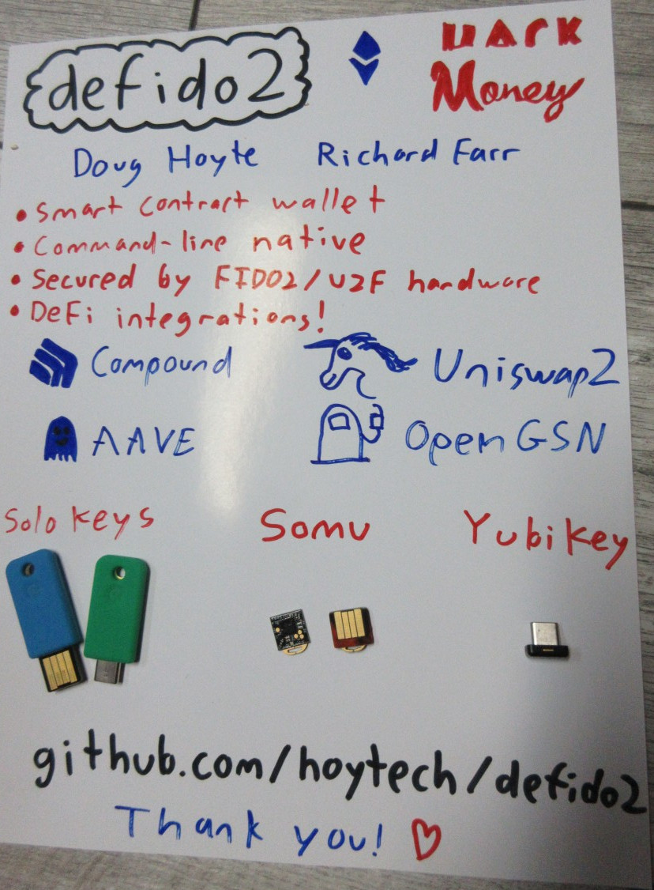

# defido2

defido2 is a command-line contract-based ethereum wallet intended for DeFi (decentralised finance) use-cases. The wallet's key material is stored on special-purpose tamper-resistant devices known as FIDO2 or U2F keys. All signature operations are performed on the key itself.

defido2 is a [Log Periodic](https://logperiodic.com) project.

FIDO2 keys are cheap and common, since they are being heavily promoted by google/twitter/github/etc for webauthn, second-factor logins. Additionally, OpenSSH now supports FIDO2 devices for password-free logins.

defido2 uses libfido2, so it should support any CTAP2-capable FIDO2 device. We've tested with 2 models of [YubiKey](https://www.yubico.com/products/), [Solo](https://solokeys.com/) USB-C, and Solo [SOMU](https://www.crowdsupply.com/solokeys/somu). Solos can be purchased for $20 on their web store.

[Check out our YouTube demo!](https://www.youtube.com/watch?v=C3628RNzWRs)

## Install

Get pre-requisites:

    git submodule update --init
    sudo apt install -y build-essential libfido2-dev libssl-dev libdocopt-dev libgmp-dev libcbor-dev
    npm i
    ## Download solc 0.6.x and put in path: https://github.com/ethereum/solidity/releases

Build:

    make -j

## Testing

You can fork mainnet for testing:

    ./node_modules/.bin/ganache-cli -f https://cloudflare-eth.com -i 999 -m 'relief drive intact sting lion law pizza scan ten genius carry timber'

## Setup

Figure out which device your key is on:

    $ ./defido2 list
    /dev/hidraw1 - 4176:1031 (Yubico/YubiKey OTP+FIDO+CCID)

Init your `defido2.json` configuration file:

    $ ./defido2 --device /dev/hidraw1 init
    Enter PIN for /dev/hidraw1: 
    Initialized file defido2.json

* Note: After entering your pin, you will have to press your FIDO2 key, to activate the "user presence" detection.

Add a private key with some ETH, so you can pay gas (eventually gas could be paid by OpenGSN instead):

    $ PRIVKEY=0xd6fe84b08cf89b2ae136196471c27ab02abddd85a306167065d90ce65ac2674b ./defido2 add-priv

Deploy your wallet:

    $ ./defido2 deploy
    Wallet deployed to 0xD1E86EA46C56758728eb95595699146250011e37

Send a transaction (permit uniswap to access your wallet's DAI):

    $ ./defido2 erc20 approve dai uniswap
    Enter PIN for /dev/hidraw1: 
    Invoking method to=0x6B175474E89094C44Da98b954EedeAC495271d0F value=0x0000000000000000000000000000000000000000000000000000000000000000 payload=0x095ea7b3000000000000000000000000f164fc0ec4e93095b804a4795bbe1e041497b92affffffffffffffffffffffffffffffffffffffffffffffffffffffffffffffff
    Sent tx: 0x0b392d220de4ec1af0b74c2d745789f4e6ca2f9e56c5e01b2db4566257df6893
    Tx mined in block 10131095 (0x95efeaaebb8b5b4beac06b39d78112689a44030ab1133da1973c85566897cbc9)

## Sub-commands

defido2 uses sub-commands, similar to how `git` does. You can run a sub-command to get its usage information:

    $ ./defido2 
    Arguments did not match expected patterns

        Usage: defido2 [--config=<config>] [--device=<device>] <command> [<args>...]

        Options:
          --config=<config>     Config file (default defido2.json)
          --device=<device>     FIDO2 device (default /dev/hidraw1)
          -h --help             Show this screen.
          --version             Show version.

        Commands:
          list       Lists available fido2 keys
          init       Inits a key
          add-priv   Adds an ethereum private key for sending transactions
          deploy     Deploy wallet
          sign       Signs a message
          eth        ETH operations
          erc20      ERC20 operations
          compound   Compound operations
          uniswap    Uniswap operations
          aave       AAVE operations

## YouTube Video

## Future work

* More DeFi integrations!
* Since FIDO2 uses secp256r1 signatures, they are expensive to verify within solidity. Each transaction uses about a million gas to verify the signature, which is very expensive and should be improved somehow.
* Currently we call out to javascript to do some of the JSON-RPC communication. Eventually we'll move the rest of this into C++ and use websockets to talk to the ethereum nodes (this is mostly done in another private project, just need to port it over).
* Finish support for resident keys, fix support for keys configured without PINs
* "Multi-sig" contracts so that you require multiple keys, or can have a back-up key in case you lose your main one
